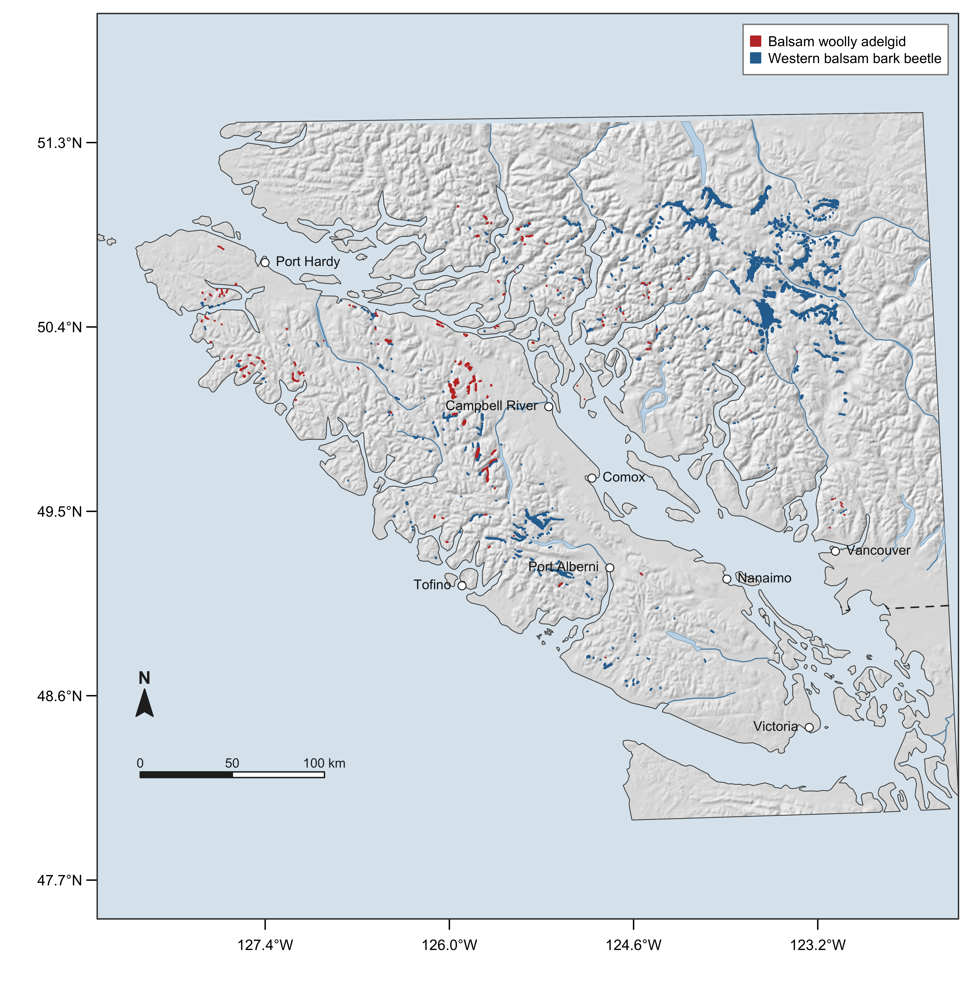
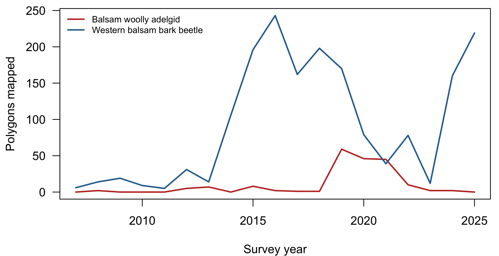

# Separating balsam woolly adelgid from bark beetle damage in Pacific silver fir

**A multi-sensor attribution test on Vancouver Island, British Columbia**

Seamus Murphy, ORCID [0000-0002-1792-0351](https://orcid.org/0000-0002-1792-0351)

## Abstract

Balsam woolly adelgid (*Adelges piceae*) and western balsam bark beetle (*Dryocoetes confusus*) are both mapped on Pacific silver fir (*Abies amabilis*) in the British Columbia aerial overview survey, so a canopy-damage detector that cannot separate them measures neither. In this study, we examine whether the addition of lidar and radar predictors to a spectral baseline improves separation of the two agents, and by how much.

> Results, discussion and conclusions are pre-registered shells marked `pending`. No predictor value has been joined to any label, so no result exists yet. Everything below is computed from the committed data extracts by `05.scripts/04-build-readme.R`.

## Figure 1

Study area on Vancouver Island and the adjacent mainland coast of British Columbia, Canada, showing aerial overview survey polygons attributed to balsam woolly adelgid and to western balsam bark beetle on true fir hosts. Relief is shaded from a 1 km digital elevation model illuminated from the northwest. Projection NAD83 / BC Albers (EPSG 3005).

## Table 1

Datasets used in the analysis, with their role and access terms.

| Dataset | Role | Source | Licence |
|---|---|---|---|
| Pest Infestation Polygons | Damage agent labels | BC Data Catalogue | Open Government Licence - British Columbia |
| Sentinel-2 L2A | Optical predictors | Google Earth Engine | Copernicus open access |
| Sentinel-1 GRD | Radar predictors | Google Earth Engine | Copernicus open access |
| LidarBC open lidar | Canopy structure predictors | LidarBC open data portal | Open Government Licence - British Columbia |

## Table 2

Aerial overview survey polygons in the study area by damage agent and host tree species. Area is the survey-recorded polygon area.

| Agent | Host | Polygons | Area (ha) |
|---|---|---|---|
| Balsam woolly adelgid | Pacific silver fir | 176 | 8,324 |
| Balsam woolly adelgid | True fir, unspecified | 12 | 118 |
| Balsam woolly adelgid | Grand fir | 2 | 6 |
| Western balsam bark beetle | Subalpine fir | 1125 | 75,797 |
| Western balsam bark beetle | Pacific silver fir | 592 | 25,685 |
| Western balsam bark beetle | True fir, unspecified | 41 | 1,756 |
| Western balsam bark beetle | Grand fir | 2 | 58 |

Both agents are recorded on Pacific silver fir, 176 adelgid against 592 bark beetle polygons. That shared host is what makes the separation an attribution problem rather than a detection problem.

## Table 3

Severity class of survey polygons by damage agent.

| Agent | Trace | Light | Moderate | Severe |
|---|---|---|---|---|
| Balsam woolly adelgid | 133 | 46 | 4 | 7 |
| Western balsam bark beetle | 1187 | 457 | 100 | 16 |

## Figure 2

Survey polygons mapped per year on true fir hosts in the study area, by damage agent.

## Table 4

Satellite scenes available over the study area for the analysis period.

| Sensor | Product | Period | Scenes |
|---|---|---|---|
| Sentinel-2 MSI | COPERNICUS/S2_SR_HARMONIZED | 2019-06-01 to 2021-09-30 | 2,877 |
| Sentinel-1 SAR | COPERNICUS/S1_GRD | 2019-06-01 to 2021-09-30 | 1,575 |

## Table 5

Lidar point cloud coverage over the study area and over the Comox field window. Acquisition years and point classes are summarised from a sample of up to 1000 tiles.

| Extent | Tiles | Full index | Acquisition years | Density (pts/m2) | Point classes |
|---|---|---|---|---|---|
| study area | 18,840 | False | 2023;2024;2025 | 8 | [1,2,7,12] |
| Comox field window | 999 | True | 2018;2019;2023;2024 | 8 | [1, 2, 7];[1, 7];[1,2,7,12];[7] |

## Table 6

Verification of the balanced accuracy implementation against cases with analytically known values.

| Case | Expected | Observed | Agrees |
|---|---|---|---|
| Perfect prediction | 1.0 | 1.0 | TRUE |
| Fully inverted prediction | 0.0 | 0.0 | TRUE |
| All assigned to majority class | 0.5 | 0.5 | TRUE |
| Imbalanced, all majority (overall accuracy 0.75) | 0.5 | 0.5 | TRUE |

## Table 7

Separation of the two damage agents by predictor set, under spatially blocked cross-validation.

| Predictor set | Balanced accuracy | Difference from spectral | 95% CI |
|---|---|---|---|
| Spectral | pending | pending | pending |
| Spectral and structure | pending | pending | pending |
| Spectral, structure and radar | pending | pending | pending |

## Table 8

Per-class performance of each model, with support.

| Predictor set | Sensitivity | Specificity | Support |
|---|---|---|---|
| Spectral | pending | pending | pending |
| Spectral and structure | pending | pending | pending |
| Spectral, structure and radar | pending | pending | pending |

